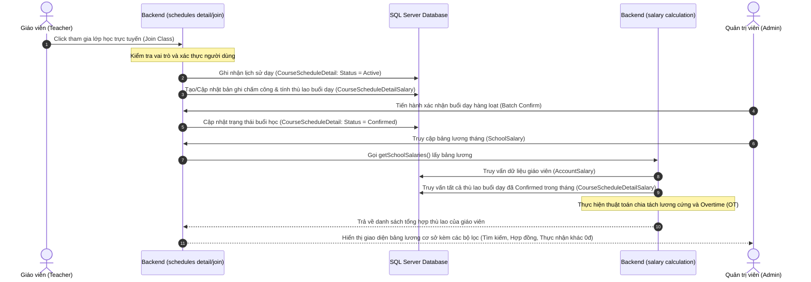

# BÁO CÁO PHÂN TÍCH THIẾT KẾ HỆ THỐNG QUẢN LÝ HỌC TẬP (LMS)
## ĐẶC TẢ USE CASE: FR-04 & FR-12

Tài liệu này đặc tả chi tiết các Use Case (UC) cho hai yêu cầu chức năng cốt lõi của hệ thống LMS: **FR-04: Quản lý lịch học** và **FR-12: Quản lý thù lao giáo viên**. Các đặc tả được thiết kế dựa trên kiến trúc thực tế của hệ thống hiện tại (Prisma, SQL Server, Express, ReactJS).

---

## 1. SƠ ĐỒ USE CASE TỔNG QUAN (Mermaid)

```mermaid
usecaseDiagram
    actor Admin as "Quản trị viên (Admin/Staff)"
    actor Teacher as "Giáo viên (Teacher)"
    actor Student as "Học viên (Student)"
    actor System as "Hệ thống (System)"

    %% UC cho FR-04
    usecase UC_04_1 as "Xem lịch học/giảng dạy"
    usecase UC_04_2 as "Tạo & Cập nhật lịch học"
    usecase UC_04_3 as "Xác nhận buổi học hàng loạt"
    usecase UC_04_4 as "Tham gia lớp học trực tuyến"

    Admin --> UC_04_1
    Admin --> UC_04_2
    Admin --> UC_04_3
    
    Teacher --> UC_04_1
    Teacher --> UC_04_4
    
    Student --> UC_04_1
    Student --> UC_04_4

    UC_04_4 --> System : "Tự động chấm công & điểm danh"

    %% UC cho FR-12
    usecase UC_12_1 as "Cấu hình chính sách thù lao"
    usecase UC_12_2 as "Xem bảng lương & đối soát"
    usecase UC_12_3 as "Xem báo cáo thu nhập cá nhân"
    usecase UC_12_4 as "Lọc danh sách thù lao"

    Admin --> UC_12_1
    Admin --> UC_12_2
    Admin --> UC_12_4

    Teacher --> UC_12_3

    UC_12_2 --> System : "Tự động tính thù lao hàng tháng"
    UC_12_3 --> System : "Tự động tính thù lao cá nhân"
```

---

## 2. ĐẶC TẢ CHI TIẾT USE CASE (FR-04: QUẢN LÝ LỊCH HỌC)

### UC-04.1: Xem lịch học / lịch giảng dạy
* **Tác nhân**: Admin, Giáo viên, Học viên.
* **Mô tả**: Cho phép các tác nhân xem lịch học chi tiết (ngày học, khung giờ, bài học, hình thức online/offline, phòng học, giáo viên phụ trách) theo tháng/tuần/ngày hoặc lớp học.
* **Tiền điều kiện**: Người dùng đã đăng nhập thành công vào hệ thống.
* **Luồng sự kiện chính**:
  1. Người dùng truy cập phân hệ **Lịch học** (từ School Dashboard hoặc Course LMS).
  2. Hệ thống gửi yêu cầu lấy lịch học tương ứng lên API `GET /v1/schedules/details` hoặc `GET /v1/schedules/course/:courseId`.
  3. Hệ thống kiểm tra vai trò người dùng:
     - *Admin*: Lấy toàn bộ lịch của cơ sở.
     - *Giáo viên / Học viên*: Chỉ lấy các buổi học liên quan trực tiếp đến cá nhân.
  4. Hệ thống trả về dữ liệu lịch học. Giao diện hiển thị dưới dạng Lịch (Calendar View) hoặc Bảng danh sách chi tiết.
* **Luồng thay thế**:
  - Người dùng lọc lịch học theo Lớp học hoặc khoảng Ngày. Hệ thống gửi tham số query và hiển thị kết quả lọc tương ứng.
* **Hậu điều kiện**: Thông tin lịch hiển thị chính xác theo thời gian thực.

### UC-04.2: Tạo và Cập nhật lịch học (Buổi học chi tiết)
* **Tác nhân**: Admin (Staff).
* **Mô tả**: Admin tạo lịch học định kỳ khi tạo lớp hoặc điều chỉnh, cập nhật từng buổi học cụ thể (thay đổi giờ học, đổi phòng học, cập nhật link online, giáo viên dạy thay, ghi chú lớp học).
* **Tiền điều kiện**: Lớp học đã được tạo trong hệ thống. Admin có quyền `ManageUsers` hoặc tương đương.
* **Luồng sự kiện chính**:
  1. Admin chọn buổi học cần cập nhật trên giao diện **Lịch học** và chọn **Chỉnh sửa**.
  2. Giao diện hiển thị form chỉnh sửa gồm: Ngày dạy, Khung giờ (Period), Trạng thái, Link online, Ghi chú, Giáo viên được phân công.
  3. Admin thực hiện thay đổi và nhấn **Lưu lại**.
  4. Hệ thống gọi API `PUT /v1/schedules/detail/:detailId` kèm payload chỉnh sửa.
  5. Backend thực hiện xác thực quyền và cập nhật thông tin trong bảng `CourseScheduleDetail` ở database.
  6. Hệ thống hiển thị thông báo thành công và làm mới (reload) dữ liệu lịch học.
* **Ngoại lệ**:
  - *Trùng lịch giáo viên*: Nếu Admin thay đổi giáo viên hoặc khung giờ dẫn đến trùng lặp lịch dạy của giáo viên đó, hệ thống sẽ báo lỗi và ngăn chặn cập nhật.
* **Hậu điều kiện**: Thông tin buổi học chi tiết được cập nhật vào database.

### UC-04.3: Xác nhận buổi học hàng loạt (Batch Confirm)
* **Tác nhân**: Admin (Staff).
* **Mô tả**: Admin kiểm duyệt và xác nhận hàng loạt các buổi học đã diễn ra để phục vụ cho việc chốt công và tính lương cho giáo viên.
* **Tiền điều kiện**: Các buổi học đã kết thúc và giáo viên đã cập nhật ghi chú/điểm danh.
* **Luồng sự kiện chính**:
  1. Admin vào tab **Lịch học** cơ sở, lọc các buổi học chưa được xác nhận.
  2. Admin tích chọn danh sách các buổi học hợp lệ và nhấn nút **Xác nhận hàng loạt**.
  3. Hệ thống gửi danh sách ID buổi học qua API `POST /v1/schedules/details/batch-confirm` với body `{ ids: [...], status: 1 }`.
  4. Backend cập nhật cột `Status` trong bảng `CourseScheduleDetail` sang trạng thái **Đã xác nhận (Confirmed)**, đồng thời ghi nhận/tính toán dữ liệu thù lao buổi dạy tương ứng trong bảng `CourseScheduleDetailSalary`.
  5. Hệ thống trả về kết quả thành công và cập nhật lại giao diện.
* **Hậu điều kiện**: Trạng thái các buổi học chuyển sang **Confirmed**, dữ liệu thù lao được tính toán sẵn sàng.

### UC-04.4: Tham gia lớp học trực tuyến (Join Online Class)
* **Tác nhân**: Giáo viên, Học viên, Hệ thống.
* **Mô tả**: Người dùng nhấp link tham gia học trực tuyến. Hệ thống tự động ghi nhận chấm công cho giáo viên và điểm danh cho học sinh khi tham gia buổi học.
* **Tiền điều kiện**: Buổi học được cấu hình hình thức Online và có liên kết phòng học (`LinkOnline`).
* **Luồng sự kiện chính**:
  1. Giáo viên/Học viên bấm nút **Vào lớp học** (Join Class) trên giao diện lịch học chi tiết.
  2. Hệ thống gọi API `POST /v1/schedules/detail/:detailId/join`.
  3. Backend ghi nhận thời gian tham gia:
     - Nếu tác nhân là **Giáo viên**: Tự động chấm công dạy, tính toán số phút giảng dạy, tạo bản ghi thù lao trong `CourseScheduleDetailSalary` nếu chưa tồn tại.
     - Nếu tác nhân là **Học viên**: Ghi nhận trạng thái tham gia vào bảng điểm danh học viên `CourseAttendanceStudent` của buổi học.
  4. Hệ thống mở cửa sổ mới dẫn đến link phòng học trực tuyến (như Google Meet, Zoom).
* **Hậu điều kiện**: Người dùng truy cập được lớp học, hệ thống lưu vết chấm công/điểm danh thành công.

---

## 3. ĐẶC TẢ CHI TIẾT USE CASE (FR-12: QUẢN LÝ THÙ LAO GIÁO VIÊN)

### UC-12.1: Cấu hình chính sách thù lao giáo viên
* **Tác nhân**: Admin.
* **Mô tả**: Admin thiết lập chế độ lương cho từng giáo viên (Lương cố định - Monthly / Lương theo giờ - Hourly, số giờ cam kết bảo hành - Warranty Hours, mức lương/thù lao, loại tiền tệ quy đổi, phương thức thanh toán và số tài khoản ngân hàng).
* **Tiền điều kiện**: Giáo viên đã có tài khoản trong hệ thống.
* **Luồng sự kiện chính**:
  1. Admin truy cập trang **Quản lý người dùng/Giáo viên**, chọn giáo viên cần cấu hình và nhấn **Chỉnh sửa**.
  2. Admin cấu hình thông số tại phần **Chính sách thù lao**:
     - *Hình thức lương*: Chọn cố định (Fixed) hoặc Theo giờ (Hourly).
     - *Mức lương*: Nhập số tiền cụ thể hàng tháng hoặc đơn giá mỗi giờ dạy.
     - *Số giờ dạy cam kết*: Chỉ áp dụng cho lương cố định (ví dụ: dạy tối thiểu 40 giờ/tháng, số giờ vượt quá sẽ tính OT).
     - *Thông tin ngân hàng*: Số tài khoản ngân hàng, phương thức thanh toán.
  3. Admin nhấn **Lưu thay đổi**.
  4. Hệ thống gọi API cập nhật thông tin tài khoản giáo viên. Dữ liệu được lưu trữ/cập nhật vào bảng `AccountSalary` thông qua Prisma transaction.
* **Hậu điều kiện**: Cấu hình lương giáo viên được cập nhật, làm cơ sở cho công thức tính lương tự động hàng tháng.

### UC-12.2: Xem bảng lương cơ sở và đối soát (Admin View)
* **Tác nhân**: Admin, Hệ thống.
* **Mô tả**: Admin xem bảng tổng hợp lương của toàn bộ giáo viên trong cơ sở theo từng tháng, đối soát chi tiết số giờ dạy thực tế, số tiết học và cơ cấu tiền lương của từng người.
* **Tiền điều kiện**: Đã có lịch dạy và các buổi học được xác nhận/chấm công trong tháng cần tra cứu.
* **Luồng sự kiện chính**:
  1. Admin truy cập tab **Lương** (Salary) trong bảng điều khiển Cơ sở (`SchoolDashboard`).
  2. Hệ thống mặc định chọn tháng hiện tại và gọi API `GET /v1/salaries/schools/:schoolId?month=YYYY-MM`.
  3. **Hệ thống tự động thực hiện tính toán lương**:
     - Lấy danh sách giáo viên của cơ sở và chính sách lương tương ứng (`AccountSalary`).
     - Lấy tất cả các buổi dạy đã ghi nhận thù lao trong tháng từ bảng `CourseScheduleDetailSalary`.
     - *Đối với giáo viên Lương cố định (TypeSalary = 1)*: Lương thực nhận = Lương cứng + Lương OT (nếu tổng giờ dạy thực tế > số giờ dạy cam kết, số giờ vượt được nhân với đơn giá giờ dạy OT và tỷ giá quy đổi).
     - *Đối với giáo viên Lương theo giờ (TypeSalary = 2)*: Lương thực nhận = Tổng tiền dạy của toàn bộ các buổi học trong tháng (số giờ dạy thực tế * đơn giá thù lao giờ dạy cấu hình tại buổi dạy).
  4. Hệ thống hiển thị bảng lương tổng hợp gồm các cột: Giáo viên, Loại hợp đồng, Tổng giờ dạy, Số lớp dạy, Lương cứng, Lương OT, Lương theo giờ, Tổng thực nhận và tài khoản ngân hàng.
  5. Admin nhấn nút **Chi tiết** của một giáo viên để xem bảng đối soát chi tiết danh sách tất cả các buổi dạy trong tháng của giáo viên đó.
* **Hậu điều kiện**: Bảng lương hiển thị chính xác, hỗ trợ đối soát minh bạch.

### UC-12.3: Lọc danh sách thù lao giáo viên
* **Tác nhân**: Admin.
* **Mô tả**: Admin sử dụng thanh công cụ lọc để tìm kiếm giáo viên cụ thể, lọc theo loại hợp đồng (cố định/theo giờ) và lọc nhanh những giáo viên có tổng thực nhận khác 0đ.
* **Tiền điều kiện**: Admin đang ở trang xem bảng lương cơ sở (UC-12.2).
* **Luồng sự kiện chính**:
  1. Tại thanh công cụ bộ lọc (Filter Toolbar), Admin thực hiện các thao tác:
     - Nhập từ khóa tại ô **Tìm kiếm** (tên giáo viên hoặc username).
     - Chọn loại hợp đồng tại select box **Loại hợp đồng** (Tất cả, Cố định, Theo giờ).
     - Chọn tiêu chí thực nhận tại select box **Thực nhận** (Tất cả, Khác 0đ).
  2. State của bộ lọc thay đổi, trigger việc lọc dữ liệu ở phía client (hoặc gọi lại API tùy cấu hình).
  3. Hệ thống kiểm tra điều kiện lọc `"Khác 0đ"`: Loại bỏ các dòng giáo viên có trường `totalEarnings` bằng `0` hoặc không có dữ liệu.
  4. Bảng danh sách lương hiển thị kết quả khớp với điều kiện lọc. Trang phân trang (Pagination) tự động quay về trang 1.
* **Hậu điều kiện**: Danh sách hiển thị đúng bộ lọc đã cấu hình.

### UC-12.4: Xem báo cáo thu nhập cá nhân (Teacher View)
* **Tác nhân**: Giáo viên, Hệ thống.
* **Mô tả**: Giáo viên đăng nhập xem chi tiết bảng tính lương, thù lao chi tiết từng lớp học, số giờ dạy tích lũy và kiểm soát chênh lệch giờ OT trực quan trong tháng.
* **Tiền điều kiện**: Giáo viên đăng nhập thành công.
* **Luồng sự kiện chính**:
  1. Giáo viên truy cập tab **Lương** trong bảng điều khiển cơ sở.
  2. Hệ thống gọi API lấy lương cá nhân. Backend kiểm tra vai trò `TEACHER` và áp dụng điều kiện lọc chỉ lấy bản ghi của chính giáo viên đang đăng nhập.
  3. Hệ thống trả về cấu trúc thù lao cá nhân.
  4. Giao diện hiển thị các thẻ KPI (Tổng thu nhập thực nhận, Tổng số giờ giảng dạy tích lũy, Trạng thái đạt/chưa đạt KPI giờ cam kết, Thông tin tài khoản ngân hàng nhận lương).
  5. Giáo viên có thể lọc xem danh sách các buổi dạy theo Lớp học hoặc tìm kiếm buổi học cụ thể.
* **Hậu điều kiện**: Giáo viên xem được thù lao cá nhân một cách minh bạch.

---

## 4. QUY TRÌNH PHỐI HỢP DỮ LIỆU GIỮA LỊCH HỌC & TÍNH LƯƠNG (Hệ thống tự động)


